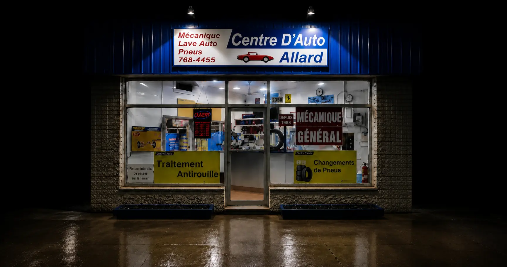
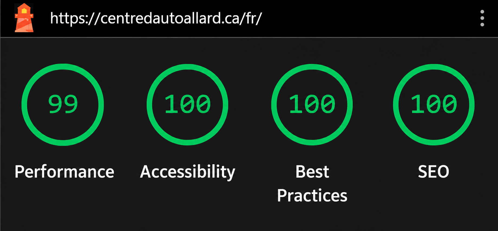
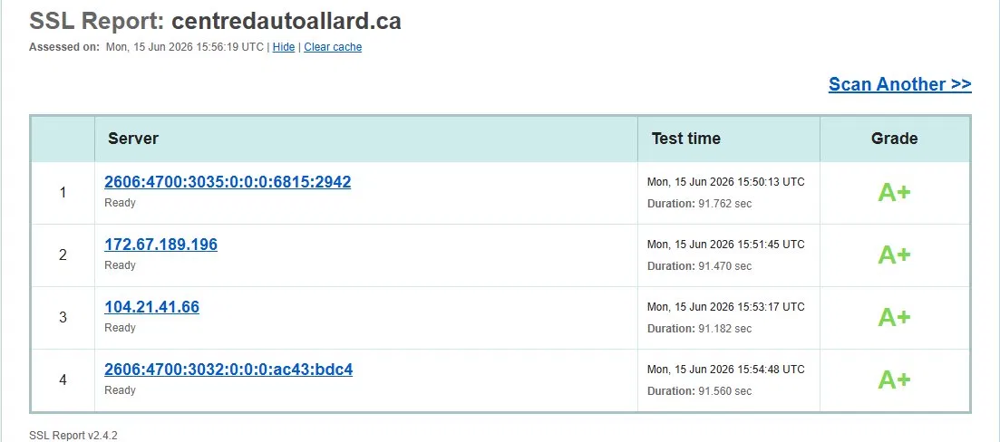
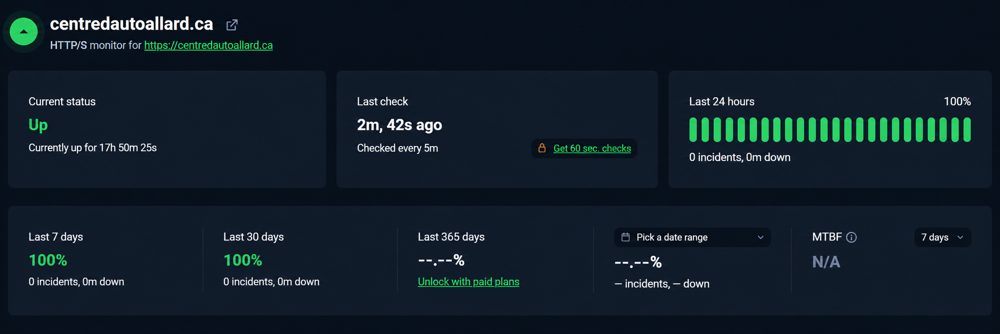

<div align="center">

# Centre D'Auto Allard

[](https://git.io/typing-svg)

A fast, accessible, bilingual website for a family-owned Montreal automotive service centre.

<br>

<p align="center">
  
  &nbsp;&nbsp;
  
  &nbsp;&nbsp;
  
  &nbsp;&nbsp;
  
  &nbsp;&nbsp;
  
</p>

<p align="center">
  
  &nbsp;&nbsp;
  
  &nbsp;&nbsp;
  
  &nbsp;&nbsp;
  
</p>

<p align="center">
  <strong>French + English</strong> &nbsp;|&nbsp;
  <strong>51 automated checks</strong> &nbsp;|&nbsp;
  <strong>100% tested-logic coverage</strong> &nbsp;|&nbsp;
  <strong>CodeQL + Trivy</strong>
</p>

<a href="https://centredautoallard.ca">
  
</a>

</div>

<br>

<div align="center">
  
</div>

<br>

<div align="center">
  <a href="https://centredautoallard.ca/fr/">
    
  </a>
</div>

## About

Centre D'Auto Allard is the production website for a family-owned automotive service centre in Montreal. It gives French- and English-speaking customers a clear, mobile-first way to explore services, call the garage, get directions, and find current business hours.

The site is statically generated with Next.js and deployed as a hardened Nginx container on a Linux VPS. GitHub Actions validates every change, scans the source and production image, publishes commit-SHA-tagged images to GHCR, and deploys approved releases over SSH. Cloudflare provides the public edge in front of the origin.

## Features

- **Bilingual experience:** complete French and English routes powered by `next-intl`.
- **Responsive design:** purpose-built layouts for mobile, tablet, desktop, and landscape displays.
- **Business conversion:** prominent phone, contact, service, and Google Maps actions.
- **Search visibility:** localized metadata, canonical URLs, `hreflang`, sitemap, robots directives, and `AutoRepair` JSON-LD.
- **Social sharing:** dedicated 1200×630 Open Graph image for Facebook, LinkedIn, Discord, and X.
- **Accessibility:** semantic structure, keyboard navigation, skip links, visible focus states, localized labels, and reduced-motion support.
- **Motion design:** polished page transitions and interactions using Framer Motion.
- **Analytics:** GA4 page-view tracking built into the static production bundle.
- **Resilience:** localized 404 and error recovery experiences with production health checks.
- **Security headers:** CSP, HSTS, frame protection, MIME sniffing protection, and restrictive permissions policy.

## Architecture

```text
CentreAutoAllard/
├─ src/
│  ├─ app/                       Static App Router pages, metadata routes, errors
│  ├─ components/                Navigation, hero, language controls, motion primitives
│  ├─ config/                    Shared business and site configuration
│  ├─ i18n/                      Locale routing and next-intl request configuration
│  └─ lib/                       SEO, animation, and utility helpers
├─ messages/                     French and English translations
├─ public/                       Storefront and social-sharing assets
├─ docs/                         Demo media, quality evidence, and README assets
├─ e2e/                          Playwright production-route tests
├─ .github/workflows/            CI, security, image publishing, production deployment
├─ dockerfile                    Multi-stage Next.js export and Nginx image
├─ docker-compose.yml            Production container definition
├─ nginx.conf                    Static routing, caching, health checks, security headers
└─ next.config.ts                Static export and localization configuration
```

<div align="center">
<pre>
┌─────────────────────────────────────────────────────────┐
│                    Customer Browser                     │
│       Responsive FR/EN UI, SEO metadata, GA4 events     │
└────────────────────────────┬────────────────────────────┘
                             │ HTTPS
┌────────────────────────────▼────────────────────────────┐
│                  Cloudflare Edge Network                │
│            TLS, DNS, proxying, edge protection          │
└────────────────────────────┬────────────────────────────┘
                             │ Origin traffic
┌────────────────────────────▼────────────────────────────┐
│                       Linux VPS                         │
│       Docker Compose → hardened Nginx container         │
└────────────────────────────┬────────────────────────────┘
                             │ Static files
┌────────────────────────────▼────────────────────────────┐
│                  Next.js Static Export                  │
│         Localized HTML, CSS, JavaScript, assets         │
└─────────────────────────────────────────────────────────┘
</pre>
</div>

## Tech Stack

| Area          | Stack                                                                        |
| ------------- | ---------------------------------------------------------------------------- |
| Framework     | Next.js 16 App Router, React 19, static export                               |
| Language      | TypeScript                                                                   |
| Styling       | Tailwind CSS, class-variance-authority, tailwind-merge                       |
| Localization  | next-intl, French and English localized routes                               |
| Motion and UI | Framer Motion, Radix Slot, Lucide React                                      |
| SEO           | Next.js Metadata API, sitemap, robots, canonical and alternate URLs, JSON-LD |
| Analytics     | Google Analytics 4                                                           |
| Testing       | Vitest, Testing Library, jsdom, Playwright                                   |
| Security      | CodeQL, Trivy, CSP and hardened Nginx response headers                       |
| DevOps        | Docker, Docker Compose, Nginx, GHCR, GitHub Actions, SSH deployment          |
| Monitoring    | UptimeRobot, container health checks, deployment smoke tests                 |
| Production    | Cloudflare, Linux VPS                                                        |

## Testing

| Suite                    |  Count | Coverage                                      |
| ------------------------ | -----: | --------------------------------------------- |
| Unit and component tests |     33 | 100% across the configured tested-logic scope |
| End-to-end checks        |     18 | Desktop and mobile Chromium                   |
| **Total**                | **51** | CI-enforced                                   |

The automated suite covers localization, SEO metadata, analytics loading, navigation, responsive content, reduced motion, Nginx behavior, static metadata routes, error recovery, contact actions, and production route smoke tests.

## CI/CD

| Workflow          | File                                      | Purpose                                                                                 |
| ----------------- | ----------------------------------------- | --------------------------------------------------------------------------------------- |
| CI                | `.github/workflows/ci.yml`                | Typecheck, lint, coverage, static build, Playwright, and Compose validation             |
| Security          | `.github/workflows/security.yml`          | CodeQL analysis plus Trivy source, secret, misconfiguration, and image scans            |
| Publish Images    | `.github/workflows/publish-images.yml`    | Build, scan, label, and publish commit-SHA-tagged GHCR images after required gates pass |
| Deploy Production | `.github/workflows/deploy-production.yml` | Deploy a selected image to the VPS over SSH and verify production health                |

```text
Push to main
    ├─ CI ───────────────┐
    └─ Security ─────────┼─> Publish GHCR image ─> Deploy production ─> Smoke test
                        └─ release blocked if a required gate fails
```

## Production Engineering

- Static output keeps the runtime surface small: no application server, database, authentication, or private API.
- The Nginx container runs as a non-root user with a read-only filesystem and isolated temporary mounts.
- Production images are pinned and published by commit SHA for traceable deployments.
- CI artifacts retain coverage, Playwright reports, and test results for diagnosis.
- Deployment records capture the image SHA and UTC release timestamp on the VPS.
- Health checks run at both the container and public production endpoint.
- External uptime monitoring through UptimeRobot checks production availability every five minutes.
- Repository and container scans fail on high or critical fixed vulnerabilities.

## Quality Gates

### Lighthouse

<div align="center">
  
</div>

**Desktop Lighthouse audit:** 99 Performance, 100 Accessibility, 100 Best Practices, and 100 SEO.

### SSL Labs

<div align="center">
  
</div>

**TLS configuration:** A+ across all assessed Cloudflare edge endpoints.

### Uptime Monitoring

<div align="center">
  
</div>

**External monitoring:** UptimeRobot checks the production site every five minutes. Container health checks, deployment smoke tests, and the public `/health` endpoint provide additional release and runtime verification.

## Quality Highlights

- Mobile-first responsive design with dedicated desktop scaling.
- Semantic HTML and keyboard-accessible interactions.
- Reduced-motion behavior for users who request it.
- Optimized static delivery with long-lived immutable asset caching.
- Localized search metadata across all public routes.
- Dedicated social preview imagery using the recommended Open Graph aspect ratio.
- Production monitoring through container health checks, smoke tests, and GA4 analytics.

## License

Copyright © 2026 Centre D'Auto Allard. All rights reserved.

The source code, configuration, design assets, and documentation are available for viewing only. See the [license](LICENSE) for the complete terms.
